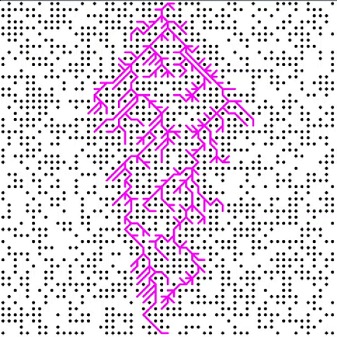
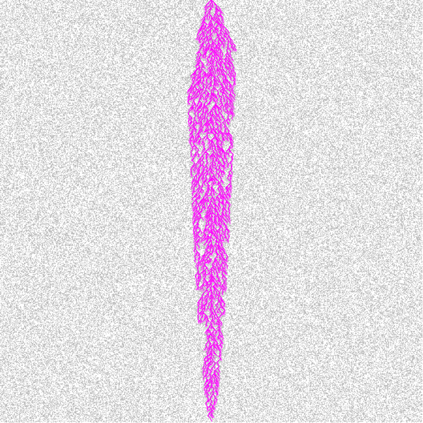
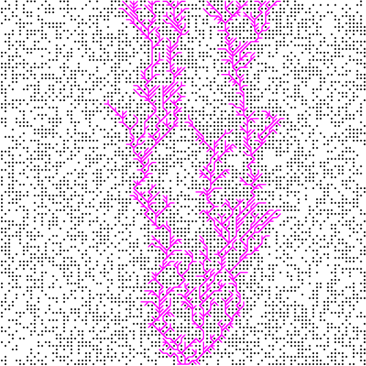
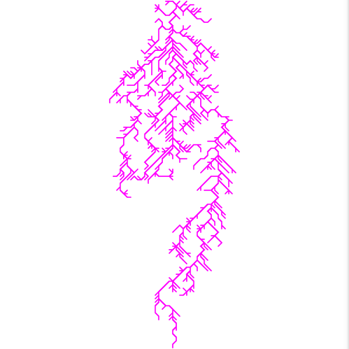
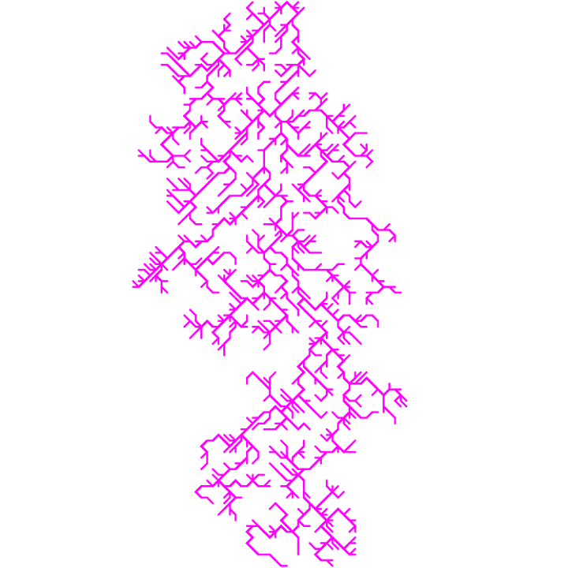

# A\* Path Finding Algorithm Visualization

See it live [here](https://amishranpariya.github.io/A_star_algorithm_visualization/) 😍

In case there is no route to reach middle bottom point it will stop; PS: Plz, refresh the page in that case.

<!-- Videos uploaded on youtube : [LinkToYoutube]() -->

### Here are some screenshot with varius size of visible maze and invisible maze

